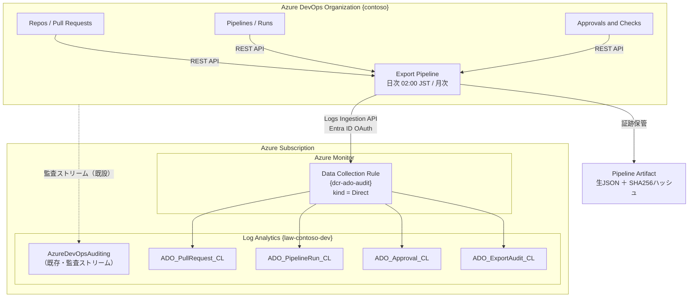
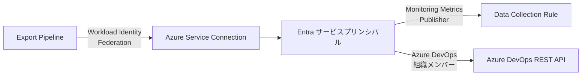

# Azure DevOps 変更管理証跡 長期保管基盤 設計概要書

| 項目 | 内容 |
|---|---|
| 文書名 | Azure DevOps 変更管理証跡 長期保管基盤 設計概要書 |
| 版数 | v1.0 |
| 対象 | 変更管理プロセス（IT統制） |
| 対象Organization | `contoso`（例。実環境の値に置き換えてください） |
| 対象Workspace | `law-contoso-dev`（例） |

---

## 1. 本書の位置づけ

Azure DevOpsには監査証跡（PR承認・Pipeline実行・ステージ承認）を長期保管する標準エクスポート機能が存在しないため、**具体的な実現方式を本書で確定**します。

---

## 2. 背景 ― なぜ追加の仕組みが必要か

### 2.1 Azure DevOps 監査ログでカバーされる範囲

Azure DevOpsの監査ログ（`AzureDevOpsAuditing`テーブル）は、**「構成・権限の変更」を記録するもの**です。以下は記録されます。

- ブランチポリシーの作成・変更・削除
- パイプライン定義の作成・変更・削除
- 権限／グループメンバーシップの変更
- サービス接続、変数グループ、環境の変更
- リリース定義の作成・変更

### 2.2 監査ログでカバーされない範囲（本設計の対象）

以下は**監査ログには残りません**。変更管理に関するIT統制では、まさにこれらが中核証跡になります。

| 証跡 | 監査ログ | IT統制上の位置づけ |
|---|---|---|
| Pull Requestの作成・マージ | ✗ | 変更内容と実施者の特定 |
| PRレビュアーの承認（Vote） | ✗ | **変更承認の証跡（最重要）** |
| ブランチポリシー評価結果 | ✗ | 統制の運用有効性の証明 |
| Pipelineの実行1件ごとの記録 | ✗ | 本番反映の事実と実施者 |
| ステージ承認（Approvals & Checks）の承認者・承認時刻・コメント | ✗ | **本番移行承認の証跡（最重要）** |

### 2.3 保持期間の制約

| 保管先 | 保持期間 | 備考 |
|---|---|---|
| Azure DevOps 組織内の監査ログ | **最大90日** | 延長不可 |
| Azure DevOps のPR／Pipeline実行履歴（UI） | 保持ポリシー依存、削除リスクあり | 消去可能なため証跡として脆弱 |
| Log Analytics（本設計） | **1,095日（3年）** | 対話型730日＋長期保持365日 |

> 外部監査対応では監査時点までの証跡保全が求められます。90日保持では、期初の変更証跡が監査時点で失われます。

---

## 3. 方式決定

### 3.1 ⚠️ 重要な前提変更：CustomLog（HTTP Data Collector API）は使用不可

| 項目 | 内容 |
|---|---|
| 旧方式 | HTTP Data Collector API（Workspace ID ＋ 共有キー、`*_CL`カスタムログ） |
| 状態 | **2026年9月14日にサポート終了**（Microsoftによる提供終了） |
| 新方式 | **Logs Ingestion API**（Data Collection Rule 方式） |
| 認証 | Microsoft Entra ID OAuth（共有キー廃止） |
| 権限 | DCRに対する `Monitoring Metrics Publisher` ロール |

旧方式（Workspace ID ＋ 共有キー）は使用できません。本設計は新方式（DCR方式＋Entra ID認証）で構築します。

### 3.2 全体アーキテクチャ



### 3.3 処理フロー

```mermaid
sequenceDiagram
    participant SCH as スケジューラ
    participant PL as Export Pipeline
    participant ADO as Azure DevOps REST API
    participant LAW as Logs Ingestion API
    participant VF as 検証ステージ

    SCH->>PL: 日次 02:00 JST 起動
    PL->>PL: 抽出期間を決定（前日分＋6時間オーバーラップ）
    PL->>ADO: プロジェクト一覧取得
    loop プロジェクトごと
        PL->>ADO: Pull Request一覧＋レビュアー＋ポリシー評価
        PL->>ADO: Build一覧＋Timeline
        PL->>ADO: Approval詳細（承認者・時刻・コメント）
    end
    PL->>PL: 生JSONをArtifact保存＋SHA256算出
    PL->>LAW: 4テーブルへバッチ取込（1MB単位分割）
    PL->>LAW: 自己監査レコード（件数・ハッシュ）取込
    PL->>VF: ExportRunIdを引き渡し
    VF->>LAW: KQLで取込件数を照合
    VF->>VF: 件数不一致なら失敗（完全性統制）
```



---

## 4. データ設計

### 4.1 テーブル構成

| テーブル | 内容 | 主な監査用途 |
|---|---|---|
| `ADO_PullRequest_CL` | PR単位の記録。レビュアーの投票、必須レビュアー数、ブランチポリシー評価結果、Jira課題キー | 変更承認証跡、職務分離 |
| `ADO_PipelineRun_CL` | Pipeline実行1件ごと。定義リビジョン、実行者、ビルド対象コミット、ステージ結果 | 本番反映の事実と実施者 |
| `ADO_Approval_CL` | ステージ承認の承認ステップ単位。承認者・承認時刻・コメント | 本番移行承認証跡、職務分離 |
| `ADO_ExportAudit_CL` | エクスポート処理自体の記録。抽出件数・取込件数・ハッシュ | **完全性統制（証跡が漏れていないことの証明）** |

保持期間：対話型 730日 ＋ 長期保持を含む合計 **1,095日（3年）**

> 補足：Azureの仕様上、対話型保持（Analytics）の上限は730日です。3年保持は「対話型730日＋長期保持365日」の構成で実現します。730日を超えた期間のクエリは検索ジョブ（Search Job）または復元（Restore）で実施します。

### 4.2 統制上の要点となる派生項目

スクリプトが抽出時に算出する項目です。監査対応の工数を大きく削減します。

| 項目 | 内容 |
|---|---|
| `JiraIssueKeys` | PRタイトル／ブランチ名／コミットメッセージから `PROJ-123` 形式のキーを抽出。**Azure Boards不使用の環境におけるトレーサビリティの要** |
| `IsSelfApproved` / `IsSelfApproval` | 申請者と承認者が同一の場合に `true`。**職務分離（SOD）違反の自動検知** |
| `ApprovedCount` / `RequiredReviewerCount` | 承認数と必須レビュアー数。無承認マージの検知 |
| `PolicyPassedCount` / `PolicyFailedCount` | ブランチポリシー評価結果。統制の運用有効性の直接証拠 |
| `PayloadSha256` | 生JSONアーカイブのハッシュ値。**改ざん検知** |

### 4.3 重複について

抽出期間は意図的に6時間オーバーラップさせています（記録が後から確定するケースの取りこぼし防止）。Log Analyticsは追記専用のため同一レコードが複数回入りますが、**`RecordId` による重複排除は参照時に行います**。

```kql
ADO_PullRequest_CL
| summarize arg_max(ExportedOn, *) by RecordId
```

監査証跡として提示するクエリは、必ずこの重複排除形を使用してください（`kql/audit-evidence-queries.kql` に整備済み）。

---

## 5. IT統制との対応

| 統制No.（想定） | 統制内容 | 証跡 | 検証クエリ |
|---|---|---|---|
| CM-01 | 変更はJira課題に紐づく | `JiraIssueKeys` | Q04 |
| CM-02 | 変更は申請者以外のレビュアーが承認する | `ApprovedCount`, `ReviewersJson` | Q02 |
| CM-03 | 申請者による自己承認を禁止する（SOD） | `IsSelfApproved`, `IsSelfApproval` | Q03 |
| CM-04 | ブランチポリシー（ビルド検証・必須レビュアー）が有効に機能している | `PolicyEvaluationsJson` | Q01 |
| CM-05 | 本番反映は権限者の承認を経る | `ADO_Approval_CL` 全項目 | Q05 |
| CM-06 | 変更証跡は3年間保全される | テーブル保持設定 | Q09 |
| CM-07 | 証跡取得処理が継続的に稼働している（完全性） | `ADO_ExportAudit_CL` | Q07, Q08 |

Q番号は `kql/audit-evidence-queries.kql` のクエリ番号です。

---

## 6. 認証方式

### 6.1 推奨：Microsoft Entra サービスプリンシパル（ワークロードID連携）



| 観点 | 内容 |
|---|---|
| シークレット | **なし**（フェデレーション認証） |
| 有効期限 | なし（PATの期限切れによる証跡欠落リスクを排除） |
| 権限（Azure側） | DCRスコープの `Monitoring Metrics Publisher` のみ（最小権限） |
| 権限（ADO側） | 組織に追加し `Project Reader` 相当（読み取り専用） |
| 監査上の利点 | 証跡取得処理が読み取り専用であり、証跡の改変が不可能であることを説明可能 |

### 6.2 代替：PAT（Personal Access Token）

自動化が困難な場合の代替です。ただし以下の理由から監査対応上は非推奨です。

- 最大有効期限1年、**期限切れで証跡取得が静かに停止する**
- 個人に紐づくため退職・異動時に失効する
- Key Vault管理とローテーション手順が別途必要

PAT採用時は、スコープを `Code (Read)` `Build (Read)` `Project and Team (Read)` に限定し、期限切れ30日前のアラート設定を必須としてください。

---

## 7. 制約事項・留意点

| No. | 制約 | 対応方針 |
|---|---|---|
| 1 | Logs Ingestion APIのリクエスト上限は1MB | スクリプトで900KB単位に自動分割済み |
| 2 | 新規カスタムテーブルへの初回取込はクエリ可能になるまで最大15分程度かかる | 検証ステージで最大15分ポーリング |
| 3 | 対話型保持の上限は730日 | 730日超は検索ジョブ／復元で対応（運用手順書に記載） |
| 4 | Azure DevOps REST APIのレート制限 | 指数バックオフによる再試行を実装済み |
| 5 | Approvals APIは「保留中」取得が主用途だが、承認IDを指定すれば完了済みも取得可能 | BuildのTimelineから承認IDを取得して個別照会する方式を採用 |
| 6 | PRの最終状態は後から確定する（マージ後のポリシー評価など） | 6時間オーバーラップ＋月次フル再スキャンで補完 |
| 7 | 削除されたプロジェクト・リポジトリの過去証跡はAPIから取得不可 | Log Analytics側に取り込み済みのデータは残存。削除前の取得が前提 |
| 8 | 本設計はAzure DevOps側の証跡が対象。Jira側の申請・承認証跡は本設計の対象外（Jira運用側の保管対象） | 責任分界として明記 |

---

## 8. 概算コスト

前提：1日あたり PR 30件、Pipeline実行 100件、承認 20件（想定する開発規模の一例）

| 項目 | 概算 |
|---|---|
| 1日あたり取込量 | 約 1〜3 MB |
| 月間取込量 | 約 30〜90 MB |
| 取込コスト（従量課金・東日本） | 月額 約 20〜60円 |
| 保持コスト（対話型730日超過分＋長期保持） | 月額 約 50〜200円（累積で漸増） |
| Pipeline実行時間 | 1回あたり 5〜15分（Self-hosted Agent使用時は追加課金なし） |

> 規模が想定を大きく超える場合でも、月額数百円規模に収まる見込みです。コスト面が導入障壁になることはありません。

---

## 9. 成果物一覧

| ファイル | 内容 |
|---|---|
| `infra/deploy-ado-audit-archive.json` | ARMテンプレート（カスタムテーブル4種＋DCR） |
| `infra/Deploy-AuditArchive.ps1` | 基盤デプロイスクリプト（冪等） |
| `pipelines/azure-pipelines-ado-audit-export.yml` | エクスポートPipeline定義 |
| `scripts/AdoAuditExport.psm1` | 抽出・取込モジュール |
| `scripts/Export-AdoAuditRecords.ps1` | エクスポート本体 |
| `scripts/Test-AdoAuditIngestion.ps1` | 取込検証スクリプト |
| `scripts/Invoke-OfflineSmokeTest.ps1` | オフライン自己テスト（36ケース） |
| `kql/audit-evidence-queries.kql` | 監査証跡クエリ集（Q01〜Q11） |
| `docs/02_導入手順書.md` | 構築手順 |
| `docs/03_検証手順書.md` | 受入テスト手順 |
| `docs/04_運用手順書.md` | 運用・監査対応手順 |
