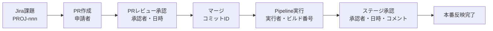

# Azure DevOps 変更管理証跡 長期保管基盤 検証手順書

| 項目 | 内容 |
|---|---|
| 版数 | v1.0 |
| 目的 | 統制の**設計の有効性**および**運用の有効性**を証明する証跡を取得する |
| 実施タイミング | 導入完了時（受入テスト）／パイロット運用中／四半期ごと |

---

## 0. 検証の考え方

内部統制評価では、以下2点の証明が必要です。本書のテストケースはこれに対応しています。

| 評価観点 | 内容 | 対応テストケース |
|---|---|---|
| 設計の有効性（Design Effectiveness） | 統制が適切に設計されているか | TC-01〜TC-05 |
| 運用の有効性（Operating Effectiveness） | 統制が期間を通じて機能しているか | TC-06〜TC-12 |

### 証跡の記録方法

各テストケースの実施時には、以下を証跡として保存してください。

1. 実行したKQLクエリ（全文）
2. 実行結果のスクリーンショット（**実行日時とワークスペース名が写り込むこと**）
3. 結果のCSVエクスポート
4. 判定（合格／不合格）と実施者・実施日

保存先：`（組織指定の証跡保管先）/IT統制/変更管理/YYYY年度/`

---

## 1. 前提条件

| # | 条件 |
|---|---|
| 1 | 導入手順書（02）のチェックリストが全て完了している |
| 2 | 本番実行が1回以上成功している |
| 3 | 検証対象期間中にPR・Pipeline実行の実績が存在する |
| 4 | Log Analyticsへのクエリ実行権限を保有している |

---

## 2. テストケース

### TC-01 テーブル構成と保持期間の確認

**目的**：証跡が3年間保全される設計であることを確認する（統制 CM-06）

**手順**

```powershell
az monitor log-analytics workspace table list `
    --resource-group <リソースグループ名> `
    --workspace-name <ワークスペース名> `
    --query "[?starts_with(name,'ADO_')].{Name:name, Plan:plan, Interactive:retentionInDays, Total:totalRetentionInDays}" `
    -o table
```

**合格基準**

| 項目 | 期待値 |
|---|---|
| テーブル数 | 4（`ADO_PullRequest_CL` / `ADO_PipelineRun_CL` / `ADO_Approval_CL` / `ADO_ExportAudit_CL`） |
| Plan | すべて `Analytics` |
| Interactive | すべて `730` |
| Total | すべて `1095` |

---

### TC-02 データ収集ルールと権限の確認

**目的**：証跡取得IDが最小権限であることを確認する

**手順**

```powershell
# DCRの存在と構成
az monitor data-collection rule show `
    --resource-group <リソースグループ名> `
    --name dcr-ado-audit `
    --query "{Kind:kind, Streams:keys(properties.streamDeclarations), Endpoint:properties.endpoints.logsIngestion}" -o json

# 割り当てられたロールの一覧
az role assignment list `
    --assignee "<サービスプリンシパルのオブジェクトID>" `
    --all --include-inherited `
    --query "[].{Role:roleDefinitionName, Scope:scope}" -o table
```

**合格基準**

| 項目 | 期待値 |
|---|---|
| DCRの `kind` | `Direct` |
| ストリーム宣言 | 4件（`Custom-ADO_*_CL`） |
| 割り当てロール | `Monitoring Metrics Publisher`（DCRスコープ）と `Log Analytics Reader`（Workspaceスコープ）**のみ** |
| 書き込み系ロール | **存在しないこと**（Contributor / Owner 等がないこと） |

> ⚠️ この結果は「証跡取得の仕組みが証跡を改変できない」ことの直接的な証拠になります。監査対応で最も説明価値の高い証跡の一つです。

---

### TC-03 Azure DevOps側権限の確認

**目的**：証跡取得IDがAzure DevOpsに対して読み取り専用であることを確認する

**手順**

1. `https://dev.azure.com/<組織名>/_settings/users` でSPのアクセスレベルを確認
2. 各プロジェクトの `Project Settings` → `Permissions` → `ADO-Audit-Export-Readers` の権限を確認
3. 書き込み操作が拒否されることを確認

```powershell
$token = (az account get-access-token --resource 499b84ac-1321-427f-aa17-267ca6975798 -o json | ConvertFrom-Json).accessToken
# 意図的に書き込みを試行する（失敗することが期待結果）
try {
    Invoke-RestMethod -Method Post `
        -Uri "https://dev.azure.com/<組織名>/<プロジェクト>/_apis/git/repositories/<リポジトリ>/pullrequests?api-version=7.1" `
        -Headers @{ Authorization = "Bearer $token"; 'Content-Type' = 'application/json' } `
        -Body '{"sourceRefName":"refs/heads/test","targetRefName":"refs/heads/main","title":"permission test"}'
    Write-Host "NG: 書き込みが成功してしまいました" -ForegroundColor Red
}
catch {
    Write-Host "OK: 書き込みは拒否されました ($($_.Exception.Response.StatusCode))" -ForegroundColor Green
}
```

**合格基準**

| 項目 | 期待値 |
|---|---|
| アクセスレベル | `Basic` |
| 付与権限 | 読み取り系のみ（Contribute / Force push / Manage permissions が Allow でないこと） |
| 書き込みAPI呼び出し | **403 Forbidden で拒否される** |

---

### TC-04 抽出処理の正常動作（ドライラン）

**目的**：抽出ロジックが期待どおり動作することを確認する

**手順**

1. Pipelineを `Export mode = custom`、`Dry run = オン` で実行（期間は実績のある直近1週間）
2. Artifactをダウンロードし、生JSONを確認

**合格基準**

| # | 確認項目 | 期待値 |
|---|---|---|
| 1 | 実行結果 | Succeeded |
| 2 | 抽出件数 | Azure DevOpsのUI上の件数と一致する |
| 3 | `pullRequests[]` の各要素 | `PullRequestId` / `CreatedByUpn` / `ReviewersJson` / `ClosedDate` に値が入っている |
| 4 | `approvals[]` の各要素 | `ActualApproverUpn` / `StepStatus` / `LastModifiedOn` に値が入っている |
| 5 | `JiraIssueKeys` | ブランチ名に `PROJ-nnn` 形式のキーを含むPRで値が抽出されている |
| 6 | SHA256 | ログに出力されている |

**件数照合の手順（重要）**

Azure DevOpsのUIで同一期間の件数を数え、突合します。

| 対象 | UI上の確認場所 | 抽出件数 | UI件数 | 一致 |
|---|---|---|---|---|
| 完了PR | `Repos` → `Pull requests` → `Completed` タブで期間フィルタ | | | ☐ |
| Pipeline実行 | `Pipelines` → `Runs` で期間フィルタ | | | ☐ |
| ステージ承認 | 対象実行の `Approvals` セクション | | | ☐ |

---

### TC-05 取込処理の正常動作

**目的**：抽出したデータが欠落なくLog Analyticsへ取り込まれることを確認する

**手順**

1. TC-04と同一期間で `Dry run = オフ` で実行
2. Verifyステージの結果を確認

**合格基準**

| # | 確認項目 | 期待値 |
|---|---|---|
| 1 | Verifyステージ | 全項目 `[PASS]` |
| 2 | 件数照合 | 抽出件数＝取込件数 |
| 3 | ハッシュ照合 | Artifactのハッシュと`ADO_ExportAudit_CL`のハッシュが一致 |

**手動確認用クエリ**

```kql
ADO_ExportAudit_CL
| where RecordType == 'Summary'
| summarize arg_max(TimeGenerated, *) by ExportRunId
| project TimeGenerated, ExportRunId, Status, ExtractedCount, IngestedCount, FailedCount, PayloadSha256
| order by TimeGenerated desc
| take 5
```

---

### TC-06 変更承認証跡の取得（統制 CM-02）

**目的**：全てのマージ済みPRに承認記録が存在することを確認する

**手順**：`kql/audit-evidence-queries.kql` の **Q01** および **Q02** を実行（期間を検証対象期間に変更）

**合格基準**

| クエリ | 期待結果 |
|---|---|
| Q01（変更一覧） | 対象期間のマージ済みPRが全件表示され、`ApprovedCount` に値がある |
| Q02（無承認マージ） | **0件** |

**Q02が0件でない場合の対応**

| 原因 | 対応 |
|---|---|
| ブランチポリシー未設定のリポジトリがある | 統制不備として起票し、ポリシーを設定 |
| ポリシーのバイパス権限を持つユーザーがマージした | バイパス権限の保有者を見直し、例外承認プロセスを定義 |
| 検証対象期間がポリシー適用前を含む | 期間を調整し、適用開始日を証跡として記録 |

---

### TC-07 職務分離の検証（統制 CM-03）

**目的**：申請者による自己承認が発生していないことを確認する

**手順**：**Q03** を実行

**合格基準**：**0件**

**0件でない場合の対応**

1. 該当PR／承認を個別に精査し、正当な理由の有無を確認
2. 正当な理由がない場合は統制不備として起票
3. 再発防止策として以下を検討
   - ブランチポリシーの「Prohibit the most recent pusher from approving their own changes」を有効化
   - Approvals & Checks の「Requesters cannot approve their own runs」を有効化

> ⚠️ この2つの設定は本統制の**予防的統制**にあたります。本証跡基盤は**発見的統制**です。監査対応では両方を説明できる状態が望ましいため、設定状況もあわせて確認してください。

---

### TC-08 トレーサビリティの検証（統制 CM-01）

**目的**：全ての変更がJira課題に紐づいていることを確認する

**手順**：**Q04** を実行

**合格基準**：**0件**

**0件でない場合の対応**

| 原因 | 対応 |
|---|---|
| Jira課題キーチェック（ブランチ命名規則・PRタイトル検査等）が未適用のリポジトリがある | 対象リポジトリにチェックを追加 |
| チェックをバイパスしたマージ | 統制不備として起票 |
| 課題キーの命名規則が想定外（想定プレフィックス以外） | スクリプトの正規表現を調整（`AdoAuditExport.psm1` の `$script:JiraKeyRegex`） |

---

### TC-09 本番移行承認証跡の取得（統制 CM-05）

**目的**：本番環境への反映が権限者の承認を経ていることを確認する

**手順**：**Q05** を実行

**合格基準**

| # | 確認項目 | 期待値 |
|---|---|---|
| 1 | 本番ステージを含む全実行に承認レコードが存在する | ✅ |
| 2 | `ActualApproverUpn` が空でない | ✅ |
| 3 | `ActualApproverUpn` が承認権限者名簿に含まれる | ✅ |
| 4 | `IsSelfApproval` が `true` の行 | **0件** |

> 承認権限者名簿との突合が必要なため、**導入先組織側の確認が必須**のテストケースです。名簿を事前にご用意ください。

---

### TC-10 エンドツーエンドのトレース検証

**目的**：監査人によるサンプル抽出に対応できることを確認する

**手順**

1. 検証対象期間から任意のJira課題キーを1件選定（本番反映まで完了しているもの）
2. **Q06** の `jiraKey` を書き換えて実行
3. 以下の連鎖が時系列で追えることを確認



**合格基準**

| # | 確認項目 | 期待値 |
|---|---|---|
| 1 | 1つのクエリで申請から本番反映まで追跡できる | ✅ |
| 2 | 各イベントに実施者（UPN）と日時が記録されている | ✅ |
| 3 | 承認者と申請者が異なる | ✅ |
| 4 | コミットIDが記録され、実際の変更内容まで辿れる | ✅ |

> このテストケースは**監査人への説明デモとしてそのまま使用できます**。実施結果は最終報告書に添付することを推奨します。

---

### TC-11 完全性統制の検証（統制 CM-07）

**目的**：証跡取得処理が期間を通じて欠落なく稼働していることを確認する

**手順**：**Q07** および **Q08** を実行

**合格基準**

| クエリ | 期待結果 |
|---|---|
| Q07（日次実行状況） | 対象期間の全日に1件以上のSummaryレコードがあり、`Succeeded = Runs` |
| Q08（欠落日検出） | **0件** |

**0件でない場合の対応**

| 原因 | 対応 |
|---|---|
| エージェントの停止 | 運用手順書（04）の「STEP R-1 欠落期間の再取得」を実施 |
| 認証エラー | SPの組織メンバーシップとロール割り当てを確認 |
| Azure DevOps側の障害 | 障害期間を記録し、再取得を実施。障害記録を証跡として保存 |

> ⚠️ 欠落が検出された場合、**再取得を実施した上で、欠落と是正の事実を記録に残してください**。隠蔽せず是正記録を残すことが、統制の運用有効性の証明になります。

---

### TC-12 改ざん耐性の検証

**目的**：保管された証跡の完全性を証明できることを確認する

**手順**

1. **Q09** を実行し、対象期間のアーカイブハッシュ一覧を取得
2. 対応するPipeline Artifactをダウンロード
3. ローカルでハッシュを再計算し突合

```powershell
$json = Get-Content -Path .\ado-audit-contoso-20261001000000.json -Raw
$sha = [System.Security.Cryptography.SHA256]::Create()
$hash = -join ($sha.ComputeHash([Text.Encoding]::UTF8.GetBytes($json)) | ForEach-Object { $_.ToString('x2') })
$sha.Dispose()
Write-Host "計算値: $hash"
```

**合格基準**

| # | 確認項目 | 期待値 |
|---|---|---|
| 1 | 計算したハッシュとQ09の `PayloadSha256` が一致 | ✅ |
| 2 | Log Analyticsのデータが追記専用であることを説明できる | ✅ |
| 3 | `Data Purger` ロールの保有者が限定されている | ✅ |

**Data Purgerロールの確認**

```powershell
az role assignment list `
    --scope "/subscriptions/<サブスクリプションID>/resourceGroups/<リソースグループ名>/providers/Microsoft.OperationalInsights/workspaces/<ワークスペース名>" `
    --query "[?roleDefinitionName=='Data Purger'].{Principal:principalName, Type:principalType}" -o table
```

> ⚠️ `Data Purger` はLog Analyticsのデータを削除できる唯一のロールです。**保有者が0件、または厳格に限定されていること**を確認し、結果を証跡として保存してください。監査人が必ず確認する項目です。

---

## 3. 検証結果記録表

| TC | 検証項目 | 統制 | 実施日 | 実施者 | 結果 | 備考 |
|---|---|---|---|---|---|---|
| TC-01 | テーブル構成と保持期間 | CM-06 | | | ☐合格 ☐不合格 | |
| TC-02 | DCRと権限 | － | | | ☐合格 ☐不合格 | |
| TC-03 | Azure DevOps側権限 | － | | | ☐合格 ☐不合格 | |
| TC-04 | 抽出処理（ドライラン） | － | | | ☐合格 ☐不合格 | |
| TC-05 | 取込処理 | CM-07 | | | ☐合格 ☐不合格 | |
| TC-06 | 変更承認証跡 | CM-02 | | | ☐合格 ☐不合格 | |
| TC-07 | 職務分離 | CM-03 | | | ☐合格 ☐不合格 | |
| TC-08 | トレーサビリティ | CM-01 | | | ☐合格 ☐不合格 | |
| TC-09 | 本番移行承認証跡 | CM-05 | | | ☐合格 ☐不合格 | |
| TC-10 | エンドツーエンドトレース | 全体 | | | ☐合格 ☐不合格 | |
| TC-11 | 完全性統制 | CM-07 | | | ☐合格 ☐不合格 | |
| TC-12 | 改ざん耐性 | CM-06 | | | ☐合格 ☐不合格 | |

**総合判定**：☐ 合格　☐ 条件付き合格（是正事項あり）　☐ 不合格

**是正事項**

| # | 内容 | 期限 | 担当 | 完了 |
|---|---|---|---|---|
| | | | | ☐ |

**承認**

| 役割 | 氏名 | 日付 | 署名 |
|---|---|---|---|
| 実施者 | | | |
| レビュアー | | | |
| 承認者 | | | |
