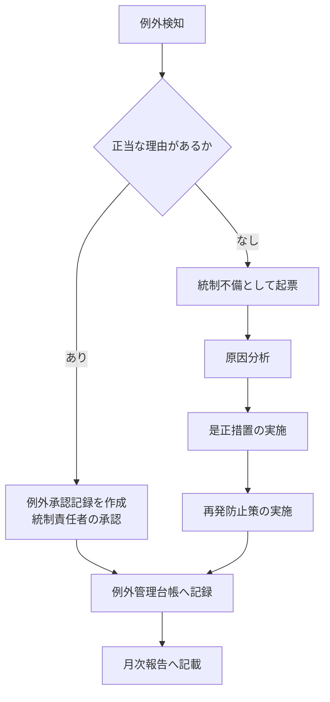

# Azure DevOps 変更管理証跡 長期保管基盤 運用手順書

| 項目 | 内容 |
|---|---|
| 版数 | v1.0 |
| 運用主体 | 導入先組織（運用担当・統制責任者） |

---

## 1. 運用カレンダー

| 頻度 | 作業 | 所要時間 | 担当 |
|---|---|---|---|
| 日次（自動） | 増分エクスポート（02:00 JST） | 自動 | － |
| 月次2日（自動） | 前月分フル再スキャン（03:00 JST） | 自動 | － |
| 月次 | 実行状況の確認と月次証跡の確定 | 30分 | 運用担当 |
| 月次 | 例外検知クエリの実行と是正 | 1時間 | 統制責任者 |
| 四半期 | 検証手順書（03）のTC-06〜TC-12を実施 | 3時間 | 統制責任者 |
| 年次 | サービスプリンシパル・権限の棚卸 | 1時間 | 管理者 |

---

## 2. 月次運用手順

### M-1. 実行状況の確認（毎月3営業日以内）

**手順**

1. Log Analyticsで **Q07** を実行（期間を前月に設定）
2. **Q08** を実行し、欠落日がないことを確認

**判定**

| 結果 | 対応 |
|---|---|
| Q08が0件 | 正常。M-2へ進む |
| Q08に欠落日がある | 「4. 障害対応」の R-1 を実施後、M-2へ |

**記録**

Q07の結果をCSVエクスポートし、証跡保管先へ保存します。

---

### M-2. 例外検知と是正

以下のクエリを実行し、検知された例外を処理します。

| クエリ | 検知内容 | 期待値 | 検知時の対応 |
|---|---|---|---|
| Q02 | 無承認マージ | 0件 | M-3 の例外処理へ |
| Q03 | 自己承認（SOD違反） | 0件 | M-3 の例外処理へ |
| Q04 | Jira課題キーなしの変更 | 0件 | M-3 の例外処理へ |

**月次サマリの取得**

**Q11** を実行し、プロジェクト別の統制サマリを取得します。結果をCSVで保存し、月次報告に添付してください。

---

### M-3. 例外処理

例外が検知された場合の処理手順です。**例外を検知して是正した記録自体が、統制が機能している証拠になります。** 隠さずに記録してください。



**例外管理台帳の記載項目**

| 項目 | 内容 |
|---|---|
| 検知日 | クエリ実行日 |
| 検知クエリ | Q02 / Q03 / Q04 |
| 対象 | PR番号またはビルド番号、WebURL |
| 内容 | 例外の具体的内容 |
| 分類 | 正当な例外 ／ 統制不備 |
| 理由・原因 | |
| 是正措置 | |
| 再発防止策 | |
| 承認者 | 統制責任者 |
| 完了日 | |

---

### M-4. 月次証跡の確定

1. **Q01** を実行（前月の全変更一覧）→ CSVエクスポート
2. **Q05** を実行（本番移行承認証跡）→ CSVエクスポート
3. **Q09** を実行（アーカイブハッシュ一覧）→ CSVエクスポート
4. 該当月のPipeline Artifactをダウンロード
5. 以下の構成で証跡保管先に保存

```
ITGC/変更管理/2026年度/2026-10/
├── Q01_変更一覧.csv
├── Q05_本番移行承認証跡.csv
├── Q07_実行状況.csv
├── Q09_アーカイブハッシュ.csv
├── Q11_月次サマリ.csv
├── 例外管理台帳.xlsx
└── artifacts/
    ├── ado-audit-contoso-20261002030000.json
    └── ...
```

> Log Analytics側に3年保持されているため、CSV保存は必須ではありません。ただし**監査人に提示する形での確定版を月次で残しておくと、監査対応時の工数が大きく減ります。** 推奨運用です。

---

## 3. 監査対応手順

### A-1. サンプル抽出への対応

監査人から特定の変更について証跡提示を求められた場合。

**Jira課題キーが指定された場合**

`kql/itgc-evidence-queries.kql` の **Q06** の `jiraKey` を書き換えて実行します。申請から本番反映までが1つの結果として出力されます。

**期間とプロジェクトが指定された場合**

**Q01** の `periodStart` / `periodEnd` を指定期間に変更して実行し、母集団を提示します。

### A-2. よくある質問と回答

| 質問 | 回答 |
|---|---|
| この証跡は改ざんできないのか | Log Analyticsは追記専用であり、削除には `Data Purger` ロールが必要。保有者を限定し、TC-12で確認済み。加えて各期間の生JSONのSHA256ハッシュを取得時点で記録しており、突合により改ざんを検知できる |
| 証跡取得の仕組み自体が改ざんされないか | 取得スクリプトはAzure Reposで管理され、mainブランチにブランチポリシーを適用。スクリプトの変更自体も変更管理統制の対象 |
| 証跡取得IDは証跡を書き換えられないか | Azure DevOpsに対しては読み取り専用権限のみ。Azure側もDCRへの送信権限（Monitoring Metrics Publisher）のみで、既存データの変更・削除権限を持たない。TC-02／TC-03で確認済み |
| 取得漏れがないことをどう証明するか | `ADO_ExportAudit_CL` に日次の実行記録と件数を保持。Q07／Q08で期間中の稼働状況を提示できる |
| 保持期間は | 1,095日（3年）。730日を超える期間は検索ジョブで参照（B-3参照） |
| PR承認は監査ログに残らないのではないか | そのとおり。Azure DevOps標準の監査ログの対象外であるため、本基盤でREST API経由で取得し長期保管している |

---

## 4. 障害対応

### R-1. 欠落期間の再取得

**発生条件**：Q08で欠落日が検出された場合、またはPipelineが失敗した場合

**手順**

1. Pipelineを手動実行
2. パラメータを以下に設定

| パラメータ | 値 |
|---|---|
| Export mode | `custom` |
| Window start (UTC) | 欠落開始日の 00:00:00Z（例：`2026-10-05T00:00:00Z`） |
| Window end (UTC) | 欠落終了日の翌日 00:00:00Z（例：`2026-10-08T00:00:00Z`） |
| Dry run | オフ |

3. Verifyステージが全項目PASSすることを確認
4. **Q08を再実行し、欠落が解消したことを確認**
5. 障害記録を作成

> 重複取込は問題ありません。参照時に `RecordId` で重複排除されます。安心して再実行してください。

**障害記録の記載項目**

| 項目 | 内容 |
|---|---|
| 発生期間 | |
| 検知日・検知方法 | |
| 原因 | |
| 影響（欠落した証跡の範囲） | |
| 再取得の実施日・ExportRunId | |
| 再取得後の確認結果（Q08） | |
| 再発防止策 | |

---

### R-2. エラー別の対処

| 症状 | 原因 | 対処 |
|---|---|---|
| `Authentication to Azure DevOps failed (HTTP 401/203)` | SPが組織から削除された／権限が変更された | 導入手順書 STEP 4 を再実施 |
| `Ingestion refused (HTTP 403)` | DCRへのロール割り当てが外れた | 導入手順書 STEP 3 を再実施 |
| `Ingestion rejected payload for stream ... (HTTP 400)` | DCRのストリーム定義とレコード構造が不一致 | ARMテンプレートを再デプロイ。スクリプトを改修した場合はテーブル列の追加が必要 |
| `No projects in scope` | プロジェクト読み取り権限がない／`ADO_PROJECT_FILTER` の指定誤り | 変数グループの値とSPの権限を確認 |
| Verifyで `[FAIL] Row count reconciliation` | 取込中のエラー、または取込遅延 | 15分後にVerifyステージのみ再実行。解消しない場合はExportログを確認 |
| Verifyが終了コード3（`data not queryable yet`） | 新規テーブルへの初回取込の反映待ち | 時間をおいてVerifyステージのみ再実行。異常ではない |
| `Paging exceeded MaxPages` エラー／`paging cap reached` 警告 | 抽出期間が長すぎる | 期間を分割して再実行 |
| Pipelineがスケジュール実行されない | エージェントのオフライン／`always: true` の未設定 | エージェント状態を確認。`Scheduled runs` で次回実行を確認 |

---

### R-3. 730日を超えた証跡の参照

対話型保持（730日）を超えたデータは通常のクエリでは参照できません。検索ジョブを使用します。

```powershell
az monitor log-analytics workspace table search-job create `
    --resource-group <リソースグループ名> `
    --workspace-name <ワークスペース名> `
    --name ADO_Approval_SRCH_CL `
    --search-query "ADO_Approval_CL | where TimeGenerated between (datetime(2026-10-01) .. datetime(2026-11-01))" `
    --limit 100000 `
    --start-search-time "2026-10-01T00:00:00Z" `
    --end-search-time "2026-11-01T00:00:00Z"
```

検索ジョブ完了後、`ADO_Approval_SRCH_CL` を通常のテーブルとしてクエリできます。

> 検索ジョブはスキャンしたデータ量に応じた課金が発生します。期間を絞って実行してください。

---

## 5. 変更管理

本基盤自体の変更も統制対象です。

| 変更内容 | 必要な手続き |
|---|---|
| 抽出項目の追加・変更 | ①Jira課題起票 → ②ARMテンプレートの列追加 → ③スクリプト改修 → ④PRレビュー承認 → ⑤検証環境で確認 → ⑥本番反映 → ⑦検証手順書TC-04／TC-05の再実施 |
| スケジュールの変更 | 同上（統制頻度に影響するため統制責任者の承認必須） |
| 保持期間の変更 | 同上（**US-SOX要件に直結するため、短縮は監査法人への事前相談が必要**） |
| 対象プロジェクトの追加 | 変数グループ `ADO_PROJECT_FILTER` の更新 → 次回実行で反映を確認 |

> ⚠️ スキーマ変更時の注意：テーブルへの列追加は、**先にARMテンプレートを再デプロイしてからスクリプトを更新**してください。順序が逆になると取込がHTTP 400で失敗します。列の削除は既存データに影響するため実施しないでください。

---

## 6. 年次棚卸

| # | 確認項目 | 確認方法 |
|---|---|---|
| 1 | サービスプリンシパルが必要最小限の権限であること | 検証手順書 TC-02 / TC-03 |
| 2 | `Data Purger` ロールの保有者が限定されていること | 検証手順書 TC-12 |
| 3 | 変数グループへのアクセス権が限定されていること | `Library` → `Security` |
| 4 | サービス接続の使用が対象Pipelineに限定されていること | `Service connections` → `Security` |
| 5 | リポジトリ `ado-audit-archive` のブランチポリシーが有効であること | `Repos` → `Branches` → `Branch policies` |
| 6 | 保持期間設定が変更されていないこと | 検証手順書 TC-01 |
| 7 | 過去1年間の実行欠落がないこと | Q08（期間を1年に設定） |

---

## 7. 連絡先

| 事項 | 連絡先 |
|---|---|
| 基盤の障害・エラー | （運用担当） |
| 統制・監査に関する判断 | （統制責任者） |
| Jira側の設定・権限 | （Jira管理者） |
